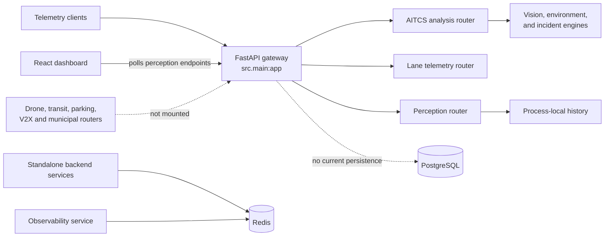
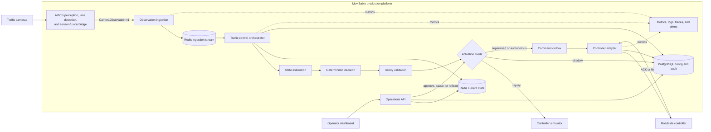

# Architecture

This document describes how the repository works today and how its components should connect for a production-oriented MVP. Delivery order and scope decisions are maintained separately in [ROADMAP.md](ROADMAP.md).

## Architectural scope

The recommended MVP shape is a modular monolith with one deployable gateway. Existing engines should remain internal modules until scaling, ownership, or isolation requirements justify extracting a service.

AITCS (AI Traffic Control System) already includes autonomous perception and lane-detection capabilities. They are mounted in the main gateway through `lane_detection_router` and `perception_router`; the production architecture hardens this existing integration.

Production rollout advances through replay, shadow, supervised, and autonomous modes. The same decision pipeline is used in every mode; only the actuation gate changes.

## Current runtime

The main gateway currently exposes only the routers registered in `src/main.py`. Most engines retain state in memory, and the standalone applications under `backend/services` are separate runtimes. PostgreSQL is started by Docker Compose but is not used by the main request path.

The current perception payloads are not yet a production camera contract: they lack event identity, camera identity, ordering, model/calibration versions, and explicit data-quality or camera-health signals.

## Target production MVP architecture

Raw video and inference remain inside the AITCS perception boundary by default. The traffic-control pipeline consumes normalized observations and optional evidence references rather than depending directly on vision-model internals.

## AITCS perception boundary

| Owner | Responsibility |
| --- | --- |
| AITCS perception subsystem | Capture frames, run inference and tracking, aggregate lane observations, report camera health, and publish model/calibration metadata. |
| AITCS traffic-control pipeline | Validate and deduplicate observations, reject stale or low-quality data, estimate traffic state, make and audit decisions, enforce safety, and deliver controller commands. |

The first versioned observation contract should include:

| Group | Minimum data |
| --- | --- |
| Identity | `schema_version`, `event_id`, `intersection_id`, `camera_id` |
| Time and order | UTC `observed_at`, sequence number |
| Traffic state | lane counts, occupancy, queue length, average speed, pedestrian count, turning movements |
| Quality and health | confidence, camera health, calibration version, model version |
| Evidence | optional reference managed by the camera subsystem, not embedded video |

The contract should be published as OpenAPI or JSON Schema with shared fixtures and consumer-driven contract tests.

`CameraObservation v1` is a working name for the canonical internal boundary. Its final shape should consolidate the existing `LaneTelemetryPayload`, `PerceptionPayload`, and combined AITCS telemetry inputs without breaking their current routes unnecessarily.

## Actuation modes

| Mode | Production behavior |
| --- | --- |
| Replay | Reprocess recorded observations against a simulator for tests and regression analysis. |
| Shadow | Run on live production observations and audit recommendations without sending commands. |
| Supervised | Require an authorized operator to approve a safety-validated command. |
| Autonomous | Send safety-validated commands automatically within approved intersection policies. |

The production MVP targets supervised actuation at one pilot intersection after a successful shadow period. Autonomous actuation is a later operational decision and does not require a new core architecture.

## Field deployment gate

Before supervised actuation, the pilot requires:

- approval of timing bounds, conflict matrices, fallback plans, and operating windows by the responsible traffic authority and traffic engineer;
- controller-protocol and vendor-conformance testing against the exact field hardware and firmware;
- an OT security review covering network separation, credentials, remote access, logging, recovery, and change control;
- camera privacy, retention, and access policies approved for the deployment jurisdiction;
- a tested local kill switch and rollback procedure that does not depend on the application remaining online.

Relevant implementation references include the [NTCIP published standards](https://www.ntcip.org/document-numbers-and-status/) for compatible signal controllers and [NIST SP 800-82 Rev. 3](https://csrc.nist.gov/pubs/sp/800/82/r3/final) for operational-technology security. Local laws and road-authority requirements take precedence; United States deployments must also follow the applicable [MUTCD](https://mutcd.fhwa.dot.gov/).

### Component responsibilities

| Component | MVP responsibility |
| --- | --- |
| Camera ingestion | Authenticate producers and validate, order, deduplicate, and buffer observations. |
| FastAPI gateway | Expose stable operations, history, approval, and control APIs. |
| Traffic control orchestrator | Run the state, decision, safety, persistence, and delivery steps in order. |
| Domain engines | Keep calculations deterministic and independent from HTTP or storage. |
| Redis | Buffer observations and hold current intersection and delivery state. |
| PostgreSQL | Store configuration and an immutable observation-to-ack audit trail. |
| Controller adapters | Implement simulator and field protocols behind the same controller port. |
| Operator dashboard | Show live state, data quality, decisions, approvals, safety overrides, and connectivity. |

## Architecture rules

- Safety validation is mandatory between every decision engine and controller adapter.
- Missing, stale, unordered, or low-confidence camera data must trigger an explicit fallback policy.
- Domain calculations must remain independent from FastAPI, Redis, PostgreSQL, and network clients.
- Application services depend on repository and controller interfaces, not concrete adapters.
- Request-critical state must not live in module-level lists or dictionaries.
- Every observation, state estimate, decision, command, and acknowledgement must share a traceable correlation chain.
- Commands require stable IDs, idempotent delivery, and explicit ACK, NACK, and timeout outcomes.
- Actuation mode and fallback policy are configured and audited per intersection.
- Operational UI values must come from production APIs; replayed or synthetic values must be clearly labelled.
